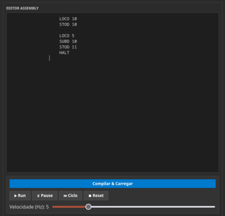
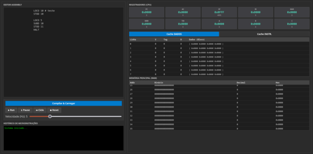

# Simulador-Mic-1

Simulador microarquitetura MIC-1, conforme descrito na 3ª edição da obra clássica "Organização Estruturada de Computadores" de Andrew S. Tanenbaum.

## Tecnologias utilizadas
O projeto é puramente client-side, rodando diretamente no navegador do seu dispositivo:
* HTML5: Estrutura semântica da interface.
* CSS3: Estilização responsiva e layout visual dos componentes.
* JavaScript: Lógica de simulação, controle de estado e manipulação do DOM

## Como Executar
Não é necessária nenhuma instalação complexa (npm, pip, etc.).

1. Clone o repositório:

```Bash
    git clone https://github.com/osmarwilliam/MIC1-Simulador.git
```
2. Acesse a pasta:
```
    cd mic1-simulador
```
3. Abra o simulador (há algumas opções):
    *  Clique com o botão direito no arquivo "index.html" clique em "Open Containing Folder" e duplo clique no arquivo "index.html"   
    *  Dê um duplo clique no arquivo index.html
    *  Use uma extensão como "Live Server" no VS Code para rodar localmente


## Como usar
1. Carregando instruções:
    * Ao abrir o simulador, você encontrará uma área para entrada de código, escrito "editor assembly".
    * 

2. Clique em compilar e carregar

3. Use os controles de reprodução  
    * Run: executa o código de maneira contínua
    * Pause: executa uma instrução por vez
    * Ciclo: pausa execução
    * Reset: reinicia o sistema

Durante a execução, observe as luzes ou indicadores nos registradores e barramentos para entender qual dado está sendo movido e qual operação está sendo realizada

## Estrutura do Projeto

```
 index.html            # Interface Principal
 style.css             # Configura toda parte visual de estilização
 main.js               # Script principal de inicialização e controle (com todo dom)
 MIC1_Componentes.js   # Definição dos registradores e  outros componentes visuais
 assembly.js           # Compilador para binário
 cache.js              # Lógica da cache que é mostrada na interface
 README.md             # Documentação do projeto
```

## Interface

Painel Esquerda:
* Editor de Assembly (na parte de cima)
* Workflow (na parte de baixo)

Painel Direita:
* Todo conjunto dos registradores
* Visualização das caches
* Tabela completa da memória RAM

# 


### Referências:
* Tanenbaum, A. S. (1990). Structured Computer Organization (3rd ed.)